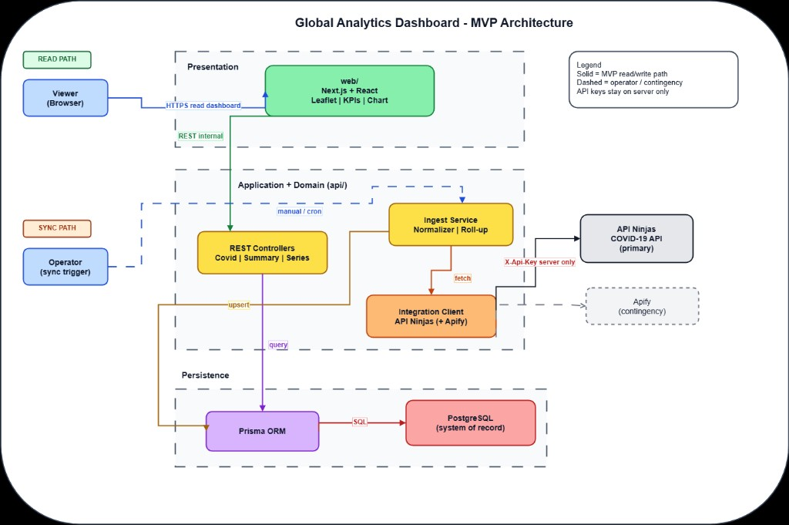
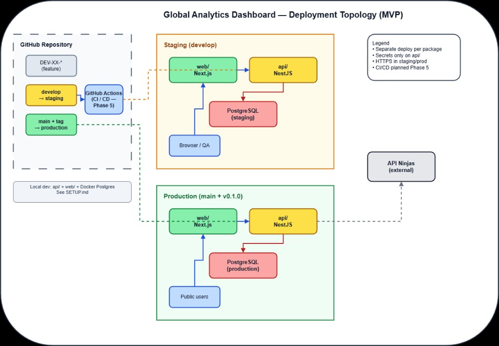
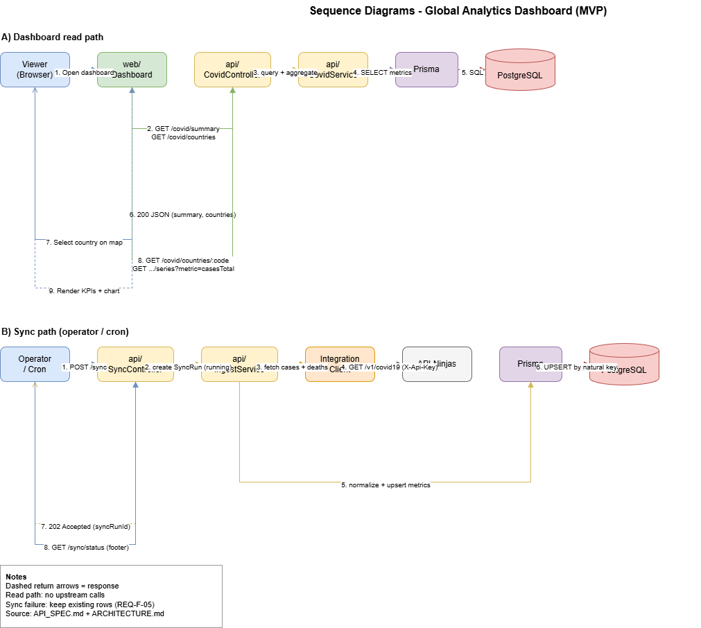

# Architecture

System architecture for **Global Analytics Dashboard** — MVP `v0.1.0`.

| | |
|---|---|
| **Version** | 1.0.0 |
| **Status** | Active |
| **Last updated** | July 2026 |

This document **consolidates** accepted decisions from [docs/adr/](./adr/) into a single technical view: layers, components, data flows, and boundaries. It does not replace ADRs — it explains how they compose at runtime.

**Related:** [REQUIREMENTS.md](./REQUIREMENTS.md) (what) · [EXTERNAL_APIS.md](./EXTERNAL_APIS.md) (upstream) · [API_SPEC.md](./API_SPEC.md) (internal REST) · [DATA_MODEL.md](./DATA_MODEL.md) (persistence)

---

## Table of Contents

1. [Purpose and scope](#1-purpose-and-scope)
2. [Architectural goals](#2-architectural-goals)
3. [System context](#3-system-context)
4. [Logical layers](#4-logical-layers)
5. [Repository structure](#5-repository-structure)
6. [Backend (`api/`)](#6-backend-api)
7. [Frontend (`web/`)](#7-frontend-web)
8. [Data flows](#8-data-flows)
9. [Security architecture](#9-security-architecture)
10. [Deployment view (MVP)](#10-deployment-view-mvp)
11. [Cross-cutting concerns](#11-cross-cutting-concerns)
12. [Diagrams](#12-diagrams)
13. [Traceability](#13-traceability)

---

## 1. Purpose and scope

**In scope:** high-level structure of the monorepo, runtime boundaries, major components, sync and read paths, security zones, MVP deployment topology.

**Out of scope:**

| Topic | Document |
|-------|----------|
| Technology choice rationale | [docs/adr/](./adr/) |
| Upstream API field catalogue | [EXTERNAL_APIS.md](./EXTERNAL_APIS.md) |
| Endpoint contracts | [API_SPEC.md](./API_SPEC.md) |
| Prisma schema / ER | [DATA_MODEL.md](./DATA_MODEL.md) |
| CI/CD and host configuration | [DEPLOYMENT.md](./DEPLOYMENT.md) (planned) |

---

## 2. Architectural goals

| Goal | How it is achieved |
|------|-------------------|
| **Clear boundaries** | Upstream calls and DB access only in `api/` ([ADR-002](./adr/ADR-002-project-architecture.md)) |
| **Persisted truth** | Ingest → PostgreSQL → internal API → dashboard ([REQ-F-01](./REQUIREMENTS.md), [REQ-F-02](./REQUIREMENTS.md)) |
| **Secret safety** | API keys server-side only ([REQ-NF-01](./REQUIREMENTS.md)) |
| **Solo maintainability** | Folder monorepo without heavy orchestration ([ADR-002](./adr/ADR-002-project-architecture.md)) |
| **Evolvable MVP** | Modular NestJS services; contingency path for upstream ([ADR-004](./adr/ADR-004-api-provider.md)) |

---

## 3. System context

```
                    ┌─────────────────────────────────────────────┐
                    │           Global Analytics Dashboard         │
                    │  (monorepo: web + api + docs + automation)  │
                    └─────────────────────────────────────────────┘
         ▲                    ▲                         ▲
         │ HTTPS              │ HTTPS                   │ HTTPS + API key
         │ (read-only)        │ (internal REST)         │ (server only)
         │                    │                         │
    ┌────┴────┐          ┌────┴────┐              ┌─────┴──────┐
    │ Viewer  │          │ Operator │              │ API Ninjas │
    │(browser)│          │ (sync)   │              │  (primary) │
    └─────────┘          └──────────┘              └────────────┘
                                                         │
                                                   ┌─────┴──────┐
                                                   │ Apify      │
                                                   │(contingency)│
                                                   └────────────┘
```

| Actor / system | Interaction |
|----------------|-------------|
| **Viewer** | Uses `web/` dashboard; no authentication in MVP |
| **Operator** | Triggers sync (manual or scheduled); no admin UI in MVP |
| **API Ninjas** | COVID-19 data source; called only from `api/` |
| **Apify** | Optional fallback if primary data insufficient ([EXTERNAL_APIS.md §7](./EXTERNAL_APIS.md#7-contingency-provider--apify)) |
| **PostgreSQL** | System of record for normalized metrics |

---

## 4. Logical layers

| Layer | Responsibility | Implementation |
|-------|----------------|----------------|
| **Presentation** | Map, KPIs, chart, country selection | `web/` — Next.js App Router, React, Tailwind, React Leaflet |
| **Application (API)** | REST resources, validation, aggregation | `api/` — NestJS controllers and services |
| **Domain / ingest** | Normalization, upsert; sync orchestration next | `api/src/ingest/` (normalizer + repository); SyncRun planned |
| **Persistence** | Storage, migrations, queries | `api/` — Prisma → PostgreSQL ([ADR-003](./adr/ADR-003-database-choice.md)) |
| **Integration** | HTTP clients to upstream providers | `api/src/integration/api-ninjas/` ([EXTERNAL_APIS.md](./EXTERNAL_APIS.md)) |

**Dependency rule:** Presentation → Application API → Persistence. Integration is invoked only from ingest/domain services, never from `web/`.

---

## 5. Repository structure

```
global-analytics-dashboard/
├── api/                 # NestJS — ingest, domain, REST, Prisma
├── web/                 # Next.js — dashboard UI
├── docs/                # Specifications, ADRs, diagrams
└── .github/             # PR template; CI workflows (planned)
```

Decision record: [ADR-002](./adr/ADR-002-project-architecture.md). Stack summary: [ADR-001](./adr/ADR-001-technology-stack.md).

No shared TypeScript package in MVP; DTO shapes may be duplicated between `api/` and `web/` until a shared package is justified.

---

## 6. Backend (`api/`)

### 6.1 Module map (NestJS)

| Module | Responsibility | Status (Phase 3) |
|--------|----------------|------------------|
| **App** | Bootstrap, config | Done |
| **Prisma** | Database client, connection lifecycle | Done |
| **Integration** | API Ninjas HTTP client; optional Apify adapter later | Done (API Ninjas) |
| **Ingest** | Normalizer, country ISO map, Prisma upsert | Done; SyncRun orchestration planned |
| **Covid** (or **Metrics**) | Read models: countries, summary, time series | Planned |
| **Sync** (optional) | Manual trigger endpoint / CLI entry for operator | Planned |

### 6.2 Internal responsibilities

1. **Fetch** upstream payloads per [EXTERNAL_APIS.md §5](./EXTERNAL_APIS.md#5-ingest-strategy-mvp).
2. **Normalize** to domain fields (`countryCode`, `referenceDate`, `casesTotal`, etc.).
3. **Aggregate** subnational rows to country level where required (e.g. Canada).
4. **Persist** via Prisma upsert ([REQ-F-02](./REQUIREMENTS.md)).
5. **Expose** read-only REST endpoints for `web/` ([REQ-F-10](./REQUIREMENTS.md)–[REQ-F-14](./REQUIREMENTS.md)).

### 6.3 Configuration

| Variable | Purpose |
|----------|---------|
| `DATABASE_URL` | PostgreSQL connection |
| `API_NINJAS_KEY` | Upstream authentication |
| `API_NINJAS_TIMEOUT_MS` | Optional upstream HTTP timeout (default 15000 ms) |
| `PORT` | HTTP listen port (default 3001 local) |

See `api/.env.example`. Secrets never committed.

---

## 7. Frontend (`web/`)

### 7.1 Planned structure (Next.js App Router)

| Area | Responsibility |
|------|----------------|
| `app/` | Routes, layout, page shell |
| `components/map/` | React Leaflet choropleth / markers ([ADR-005](./adr/ADR-005-map-library.md)) |
| `components/kpis/` | KPI cards bound to summary API |
| `components/charts/` | Time-series chart (confirmed cases) |
| `lib/api/` | Typed client for internal REST base URL |

### 7.2 Client constraints

- **Server Components** where possible; map and chart as **client components** (`"use client"` / dynamic import, no Leaflet SSR).
- **No** upstream API keys or direct calls to API Ninjas.
- **Environment:** `NEXT_PUBLIC_API_URL` points to deployed `api/` (or `http://localhost:3001` in development).

---

## 8. Data flows

### 8.1 Sync path (write)

```
Operator / cron
    → IngestService.trigger()
        → IntegrationClient (API Ninjas)
        → Normalizer + country roll-up
        → Prisma upsert
        → PostgreSQL
```

| Step | Notes |
|------|-------|
| Trigger | Manual (dev) or daily job (staging/prod) — [REQ-F-03](./REQUIREMENTS.md), [REQ-F-04](./REQUIREMENTS.md) |
| Failure | Log error; do not delete existing rows — [REQ-F-05](./REQUIREMENTS.md) |
| Metadata | `lastSyncedAt` exposed for UI footer — [REQ-F-06](./REQUIREMENTS.md), [REQ-F-52](./REQUIREMENTS.md) |

### 8.2 Read path (dashboard)

```
Viewer browser
    → web/ (Next.js)
        → GET /covid/... (internal REST, API_SPEC §6)
            → CovidController (DTO + ISO2 pipe validation)
            → CovidService (country / global / series roll-up §8)
            → CovidQueryService (Prisma parameterized queries)
                → PostgreSQL (indexes on countryCode+referenceDate, referenceDate)
    → Render map + KPIs + chart
```

| Concern | Approach |
|---------|----------|
| Subnational rows | Never returned in JSON — national row preferred, else sum regions |
| Empty DB | `200` with `null` metrics / empty arrays (not `500`) |
| Input safety | Uppercase ISO2 only; calendar `YYYY-MM-DD`; series span capped |
| Auth | Out of scope for MVP — read-only public internal API |

Country selection in UI filters client state and subsequent API calls (country-scoped endpoints per [API_SPEC.md](./API_SPEC.md)).

### 8.3 Data freshness

Upstream probe shows historical series ending ~2023-03 for Brazil ([EXTERNAL_APIS.md §6](./EXTERNAL_APIS.md#6-gaps-risks-and-mitigations)). Architecture treats PostgreSQL as the **serving layer** regardless of upstream cadence; UI must display last sync time.

---

## 9. Security architecture

| Zone | Trust | Rules |
|------|-------|-------|
| **Public browser** | Untrusted | Read-only dashboard; no secrets |
| **`web/` server** | Trusted app tier | Only `NEXT_PUBLIC_*` exposed to browser |
| **`api/`** | Trusted app tier | Holds upstream keys; validates input; no stack traces in prod |
| **PostgreSQL** | Private network | Accessible only from `api/` |
| **Upstream APIs** | External | TLS; API keys in headers |

Authentication is **out of scope** for MVP ([REQUIREMENTS.md §9](./REQUIREMENTS.md#9-out-of-scope--mvp)).

---

## 10. Deployment view (MVP)

```
┌──────────────┐     ┌──────────────┐     ┌──────────────┐
│   Browser    │────▶│  web/        │     │  api/        │
│              │     │  (Next.js)   │────▶│  (NestJS)    │
└──────────────┘     │  staging /   │     │  staging /   │
                     │  production  │     │  production  │
                     └──────────────┘     └──────┬───────┘
                                                   │
                     ┌──────────────┐     ┌──────▼───────┐
                     │  PostgreSQL  │◀────│  (Prisma)    │
                     │  (managed /  │     └──────────────┘
                     │   Docker)    │
                     └──────────────┘
```

| Environment | Branch | Components |
|-------------|--------|------------|
| **Local** | feature / `main` (docs) | `api/`, `web/`, PostgreSQL via Docker Compose (Phase 3) |
| **Staging** | `develop` | Integrated builds; pre-production validation |
| **Production** | `main` | Tagged releases `v0.1.0` |

Host targets and pipelines: [DEPLOYMENT.md](./DEPLOYMENT.md). Git workflow: [CONTRIBUTING.md](../CONTRIBUTING.md).

---

## 11. Cross-cutting concerns

| Concern | Approach |
|---------|----------|
| **Logging** | NestJS logger for ingest and API errors — [REQ-NF-07](./REQUIREMENTS.md) |
| **Testing** | Jest in `api/` for ingest and endpoints; web lint/build in CI — [REQ-NF-04](./REQUIREMENTS.md), [REQ-NF-05](./REQUIREMENTS.md) |
| **Errors** | Stable JSON error shape from `api/` — [REQ-F-13](./REQUIREMENTS.md) |
| **Config** | Environment variables per package; `.env.example` templates |
| **Documentation** | Code changes that alter behavior update API_SPEC / DATA_MODEL / this doc — [REQ-NF-10](./REQUIREMENTS.md) |

---

## 12. Diagrams

Source files live in `diagrams/` (editable in Draw.io). **PNG previews** in `assets/` allow GitHub and Markdown viewers to render diagrams without opening Draw.io.

### PNG index

| Preview | Source (Draw.io) | Used in |
|---------|------------------|---------|
|  | [architecture.drawio](./diagrams/architecture.drawio) | This doc, root [README.md](../README.md) |
|  | [deployment.drawio](./diagrams/deployment.drawio) | [DEPLOYMENT.md](./DEPLOYMENT.md) |
|  | [er-diagram.drawio](./diagrams/er-diagram.drawio) | [DATA_MODEL.md](./DATA_MODEL.md) |
|  | [sequence-diagram.drawio](./diagrams/sequence-diagram.drawio) | [API_SPEC.md](./API_SPEC.md) |
|  | [domain-model.drawio](./diagrams/domain-model.drawio) | [DATA_MODEL.md](./DATA_MODEL.md) |

| Diagram | Description |
|---------|-------------|
| **System architecture** | Layers, components, external systems |
| **Deployment** | Staging/production topology, branch → environment flow |
| **ER diagram** | Relational entities and keys |
| **Sequence** | Read and sync HTTP flows |
| **Domain model** | Domain services and entities |

### Export PNG (Cursor / VS Code Draw.io extension)

1. Open a `.drawio` file under `docs/diagrams/` in Cursor (Draw.io extension must be installed).
2. **File → Export as → PNG…** (or right-click the diagram tab → Export).
3. Save to `docs/assets/` using the matching filename from the table above (e.g. `deployment.drawio` → `deployment.png`).
4. Repeat for each diagram when the source `.drawio` changes.

**Expected result:** five PNG files in `docs/assets/` (`architecture.png`, `deployment.png`, `er-diagram.png`, `sequence-diagram.png`, `domain-model.png`).

### Export PNG (script — optional)

Requires outbound HTTPS to a Draw.io export host (may be blocked on some networks):

```bash
node scripts/export-drawio-png.mjs docs/diagrams/architecture.drawio docs/assets/architecture.png
node scripts/export-drawio-png.mjs docs/diagrams/deployment.drawio docs/assets/deployment.png
node scripts/export-drawio-png.mjs docs/diagrams/er-diagram.drawio docs/assets/er-diagram.png
node scripts/export-drawio-png.mjs docs/diagrams/sequence-diagram.drawio docs/assets/sequence-diagram.png
node scripts/export-drawio-png.mjs docs/diagrams/domain-model.drawio docs/assets/domain-model.png
```

Override host if needed: `DRAWIO_EXPORT_HOST=exp-pdf.draw.io` (default in script).

### Online editor

Open `.drawio` files with [app.diagrams.net](https://app.diagrams.net/) if you prefer the browser editor.

---

## 13. Traceability

| ADR | Architectural element |
|-----|----------------------|
| [ADR-001](./adr/ADR-001-technology-stack.md) | Stack per layer |
| [ADR-002](./adr/ADR-002-project-architecture.md) | Monorepo, boundaries |
| [ADR-003](./adr/ADR-003-database-choice.md) | PostgreSQL + Prisma |
| [ADR-004](./adr/ADR-004-api-provider.md) | Integration layer, ingest |
| [ADR-005](./adr/ADR-005-map-library.md) | Presentation map component |

| Phase | Deliverable |
|-------|-------------|
| 2 | DATA_MODEL, API_SPEC, diagrams, SETUP, DEPLOYMENT — **complete** |
| 3 (current) | Module implementation in `api/` — Prisma, ingest, REST |
| 4 | Dashboard components in `web/` |

---

## Related documents

| Document | Purpose |
|----------|---------|
| [docs/adr/](./adr/) | Decision records |
| [EXTERNAL_APIS.md](./EXTERNAL_APIS.md) | Upstream contracts |
| [PROJECT_MANAGEMENT.md](./PROJECT_MANAGEMENT.md) | Phases and milestones |
