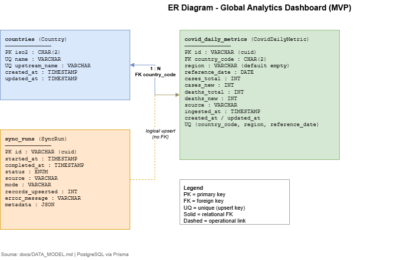
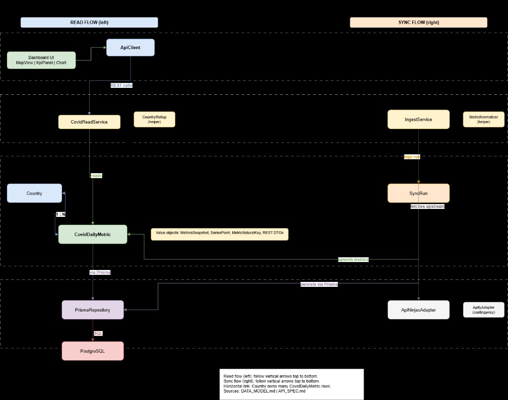

# Data Model

Persistence model for **Global Analytics Dashboard** — PostgreSQL via Prisma ([ADR-003](./adr/ADR-003-database-choice.md)).

| | |
|---|---|
| **Version** | 1.0.0 |
| **Status** | Active |
| **Last updated** | July 2026 |
| **Implementation path** | `api/prisma/schema.prisma` (Phase 3) |

This document defines **entities**, **relationships**, **natural keys**, and the **proposed Prisma schema**. Upstream field mapping: [EXTERNAL_APIS.md](./EXTERNAL_APIS.md). Internal read API: [API_SPEC.md](./API_SPEC.md).

---

## Table of Contents

1. [Purpose and scope](#1-purpose-and-scope)
2. [Design principles](#2-design-principles)
3. [Conceptual model](#3-conceptual-model)
4. [Entities](#4-entities)
5. [Natural keys and idempotency](#5-natural-keys-and-idempotency)
6. [Upstream mapping](#6-upstream-mapping)
7. [Query patterns (MVP)](#7-query-patterns-mvp)
8. [Proposed Prisma schema](#8-proposed-prisma-schema)
9. [Migrations and evolution](#9-migrations-and-evolution)
10. [Traceability](#10-traceability)

---

## 1. Purpose and scope

**In scope:** domain entities, relational model, Prisma types, uniqueness constraints, ingest upsert behaviour, country roll-up rules for MVP.

**Out of scope:** HTTP endpoint shapes ([API_SPEC.md](./API_SPEC.md)), NestJS service code, Docker/connection strings ([SETUP.md](./SETUP.md)).

---

## 2. Design principles

| Principle | Application |
|-----------|-------------|
| **Normalized facts** | One row per country/region/date; cases and deaths on the same row after ingest merge |
| **Idempotent ingest** | Upsert on stable natural key — safe to re-run sync |
| **Source fidelity** | Store subnational rows when upstream provides them (e.g. Canada provinces) |
| **MVP read simplicity** | Country-level API aggregates regions at query time ([EXTERNAL_APIS.md §5](./EXTERNAL_APIS.md#5-ingest-strategy-mvp)) |
| **Auditability** | `source` and `ingestedAt` on facts; `SyncRun` for job history |
| **ISO country codes** | `Country.iso2` is the canonical geographic identifier for map join (GeoJSON) |

---

## 3. Conceptual model

```
┌─────────────┐       ┌──────────────────────┐
│   Country   │ 1   * │   CovidDailyMetric   │
│  (lookup)   │───────│  (fact / time slice) │
└─────────────┘       └──────────────────────┘
                              ▲
                              │ records upserted during
┌─────────────┐               │
│   SyncRun   │───────────────┘
│  (metadata) │
└─────────────┘
```

| Entity | Role |
|--------|------|
| **Country** | Stable catalogue: ISO code ↔ API Ninjas country name |
| **CovidDailyMetric** | Daily COVID-19 metrics per country/region |
| **SyncRun** | One record per ingest execution (success/failure, counts) |

Visual references (PNG exports — regenerate via [ARCHITECTURE.md §12](./ARCHITECTURE.md#12-diagrams)):





---

## 4. Entities

### 4.1 Country

Reference table for geographic identity and map alignment.

| Field | Type | Constraints | Description |
|-------|------|-------------|-------------|
| `iso2` | `String` | PK, 2 chars | ISO 3166-1 alpha-2 (e.g. `BR`, `CA`) |
| `name` | `String` | unique | Canonical display name (English) |
| `upstreamName` | `String` | unique | Exact API Ninjas `country` string used in requests |
| `createdAt` | `DateTime` | default now | Row creation |
| `updatedAt` | `DateTime` | updated | Last mapping change |

**Seeding:** Built during first sync from snapshot `date` response + static overrides for spelling mismatches (e.g. `United States`).

### 4.2 CovidDailyMetric

Atomic fact: metrics for one **reference date**, one **country**, optional **region**.

| Field | Type | Constraints | Description |
|-------|------|-------------|-------------|
| `id` | `String` | PK, cuid/uuid | Surrogate key |
| `countryCode` | `String` | FK → `Country.iso2` | ISO2 |
| `region` | `String` | default `""` | Subnational name; empty = national aggregate row from upstream |
| `referenceDate` | `DateTime` | `@db.Date` | Calendar date of the metric |
| `casesTotal` | `Int` | nullable | Cumulative confirmed cases |
| `casesNew` | `Int` | nullable | New cases on `referenceDate` |
| `deathsTotal` | `Int` | nullable | Cumulative deaths |
| `deathsNew` | `Int` | nullable | New deaths on `referenceDate` |
| `source` | `String` | | `api-ninjas` or `apify` |
| `ingestedAt` | `DateTime` | default now | Last upsert from sync |
| `createdAt` | `DateTime` | default now | |
| `updatedAt` | `DateTime` | updated | |

**Note on REQ-F-33 (active cases):** Upstream does not provide active cases ([EXTERNAL_APIS.md G-01](./EXTERNAL_APIS.md#6-gaps-risks-and-mitigations)). Third KPI uses **`casesNew`** on latest `referenceDate` (or latest `casesTotal` delta) until requirements are formally amended.

### 4.3 SyncRun

Operational log for ingest jobs ([REQ-F-06](./REQUIREMENTS.md), [REQ-NF-07](./REQUIREMENTS.md)).

| Field | Type | Constraints | Description |
|-------|------|-------------|-------------|
| `id` | `String` | PK, cuid/uuid | |
| `startedAt` | `DateTime` | | Job start |
| `completedAt` | `DateTime` | nullable | Job end |
| `status` | `Enum` | | `running`, `success`, `failed` |
| `source` | `String` | | `api-ninjas` (default) |
| `mode` | `String` | | e.g. `snapshot`, `country-series`, `full` |
| `recordsUpserted` | `Int` | default 0 | Rows written |
| `errorMessage` | `String` | nullable | Failure detail |
| `metadata` | `Json` | nullable | Optional: date param, country list, HTTP status |

**`lastSyncedAt` for UI:** `MAX(completedAt) WHERE status = success` on `SyncRun`, or latest `ingestedAt` on `CovidDailyMetric` — implementer chooses; expose via internal API.

---

## 5. Natural keys and idempotency

### 5.1 Unique constraint (upsert key)

```
(countryCode, region, referenceDate)
```

| Rule | Detail |
|------|--------|
| **Upsert** | `prisma.covidDailyMetric.upsert({ where: { countryCode_region_referenceDate }, ... })` with composite unique |
| **Re-sync** | Same key updates metrics and `ingestedAt` — no duplicates |
| **Empty region** | Store `region = ""` (empty string), not NULL, for consistent uniqueness |

### 5.2 Ingest merge (cases + deaths)

API Ninjas returns cases and deaths in **separate calls** (`type` param) or separate object keys (`cases` vs `deaths`).

| Step | Action |
|------|--------|
| 1 | Parse cases payload → set `casesTotal`, `casesNew` |
| 2 | Parse deaths payload → set `deathsTotal`, `deathsNew` |
| 3 | Upsert same natural key — second pass **merges** into existing row |

Partial failure: if deaths call fails, cases row remains ([REQ-F-05](./REQUIREMENTS.md)).

---

## 6. Upstream mapping

### 6.1 Time series mode (`?country=`)

For each upstream object `{ country, region, cases: { "YYYY-MM-DD": { total, new } } }`:

| Upstream | `CovidDailyMetric` |
|----------|-------------------|
| `country` | Resolve → `countryCode` via `Country.upstreamName` |
| `region` | `region` (empty string if blank) |
| date key | `referenceDate` |
| `total` | `casesTotal` or `deathsTotal` (by call type) |
| `new` | `casesNew` or `deathsNew` |

### 6.2 Snapshot mode (`?date=`)

For each `{ country, region, cases: { total, new } }`:

| Upstream | `CovidDailyMetric` |
|----------|-------------------|
| `date` query param | `referenceDate` |
| `cases.total` / `cases.new` | `casesTotal` / `casesNew` |
| deaths call | `deathsTotal` / `deathsNew` |

### 6.3 Country code resolution

| Input | Output |
|-------|--------|
| API Ninjas `country` string | Lookup `Country.upstreamName` → `iso2` |
| Unknown name | Log warning; skip row or queue for mapping table update |

---

## 7. Query patterns (MVP)

These inform [API_SPEC.md](./API_SPEC.md) and Prisma queries in Phase 3.

### 7.1 Global summary (KPIs)

Latest `referenceDate` with data; sum across all countries:

- Prefer **country-level rows only** (`region = ""`) when present
- Else **sum all regions** grouped by `countryCode`, then sum countries

```sql
-- illustrative: latest date national rows
SELECT SUM(cases_total), SUM(deaths_total), SUM(cases_new)
FROM covid_daily_metrics
WHERE reference_date = (SELECT MAX(reference_date) FROM covid_daily_metrics)
  AND region = '';
```

### 7.2 Country summary

Filter `countryCode = :code` on latest `referenceDate`; aggregate regions if multiple rows exist.

### 7.3 Time series (chart)

```sql
-- illustrative
SELECT reference_date, SUM(cases_total) AS cases_total
FROM covid_daily_metrics
WHERE country_code = :code
GROUP BY reference_date
ORDER BY reference_date;
```

### 7.4 Map choropleth

Latest `referenceDate`; one value per `countryCode` (aggregated); join to GeoJSON by `iso2`.

### 7.5 Country list

Distinct `Country` rows with latest metric snapshot joined or subqueried.

---

## 8. Proposed Prisma schema

Target file: `api/prisma/schema.prisma` (not yet created).

```prisma
generator client {
  provider = "prisma-client-js"
}

datasource db {
  provider = "postgresql"
  url      = env("DATABASE_URL")
}

enum SyncStatus {
  running
  success
  failed
}

model Country {
  iso2          String   @id @db.Char(2)
  name          String   @unique
  upstreamName  String   @unique @map("upstream_name")
  createdAt     DateTime @default(now()) @map("created_at")
  updatedAt     DateTime @updatedAt @map("updated_at")

  metrics CovidDailyMetric[]

  @@map("countries")
}

model CovidDailyMetric {
  id            String   @id @default(cuid())
  countryCode   String   @map("country_code") @db.Char(2)
  region        String   @default("")
  referenceDate DateTime @map("reference_date") @db.Date
  casesTotal    Int?     @map("cases_total")
  casesNew      Int?     @map("cases_new")
  deathsTotal   Int?     @map("deaths_total")
  deathsNew     Int?     @map("deaths_new")
  source        String   @default("api-ninjas")
  ingestedAt    DateTime @default(now()) @map("ingested_at")
  createdAt     DateTime @default(now()) @map("created_at")
  updatedAt     DateTime @updatedAt @map("updated_at")

  country Country @relation(fields: [countryCode], references: [iso2])

  @@unique([countryCode, region, referenceDate])
  @@index([countryCode, referenceDate])
  @@index([referenceDate])
  @@map("covid_daily_metrics")
}

model SyncRun {
  id               String     @id @default(cuid())
  startedAt        DateTime   @default(now()) @map("started_at")
  completedAt      DateTime?  @map("completed_at")
  status           SyncStatus @default(running)
  source           String     @default("api-ninjas")
  mode             String
  recordsUpserted  Int        @default(0) @map("records_upserted")
  errorMessage     String?    @map("error_message")
  metadata         Json?

  @@index([startedAt])
  @@map("sync_runs")
}
```

---

## 9. Migrations and evolution

| Phase | Action |
|-------|--------|
| **Phase 3** | Add `api/prisma/schema.prisma`; initial migration `init` |
| **Seed** | Optional script: ISO country list + `upstreamName` aliases |
| **Post-MVP** | Extra columns (tests, recovered) if Apify activated; new migration |
| **Change control** | Schema change → migration + update this doc + API_SPEC if contracts shift |

---

## 10. Traceability

| Requirement / ADR | Model element |
|-------------------|---------------|
| [REQ-F-02](./REQUIREMENTS.md) | `CovidDailyMetric` + upsert key |
| [REQ-F-06](./REQUIREMENTS.md), [REQ-F-52](./REQUIREMENTS.md) | `SyncRun`, `ingestedAt` |
| [ADR-003](./adr/ADR-003-database-choice.md) | Prisma + PostgreSQL |
| [EXTERNAL_APIS.md §4](./EXTERNAL_APIS.md#4-normalized-domain-mapping) | Field mapping §6 |
| [ARCHITECTURE.md §6](./ARCHITECTURE.md#6-backend-api) | Persistence layer |

| Downstream | Uses this doc |
|------------|---------------|
| [API_SPEC.md](./API_SPEC.md) | Response DTOs derived from entities |
| `diagrams/er-diagram.drawio` | Visual ER — PNG: [assets/er-diagram.png](./assets/er-diagram.png) |
| `diagrams/domain-model.drawio` | Domain view — PNG: [assets/domain-model.png](./assets/domain-model.png) |

---

## Related documents

| Document | Purpose |
|----------|---------|
| [EXTERNAL_APIS.md](./EXTERNAL_APIS.md) | Upstream payloads |
| [ARCHITECTURE.md](./ARCHITECTURE.md) | System layers |
| [REQUIREMENTS.md](./REQUIREMENTS.md) | Product behaviour |
